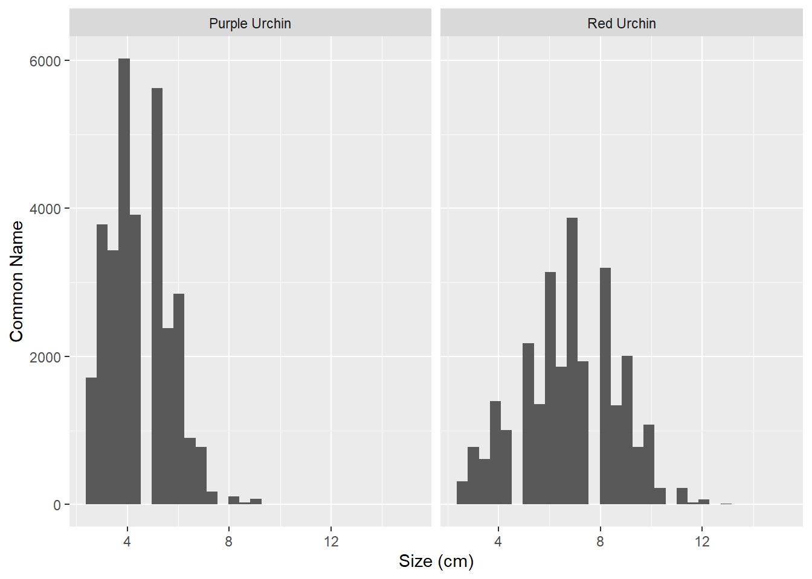
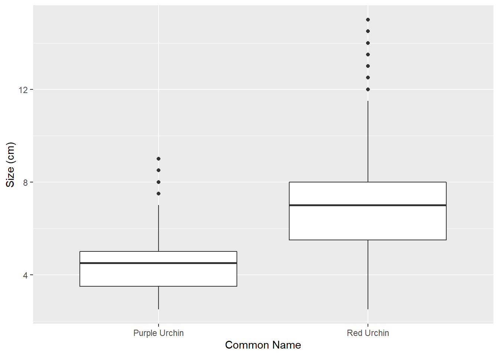
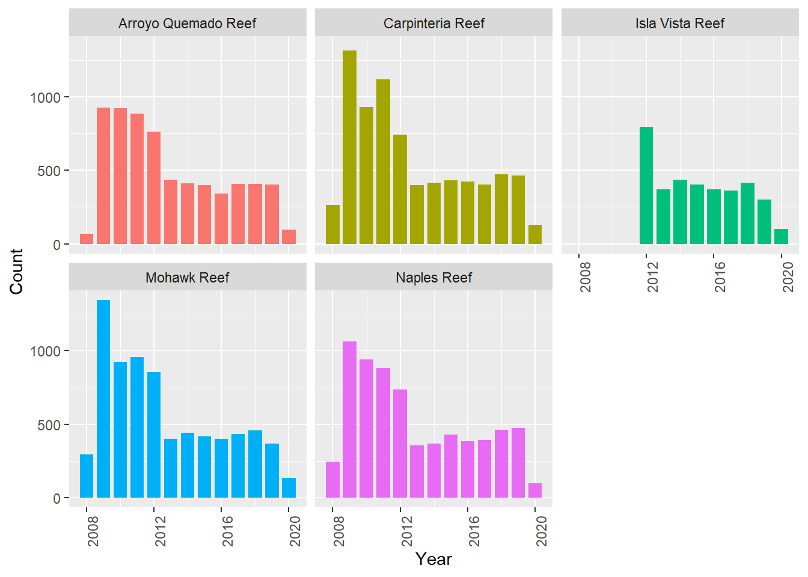

# Exploring and Analysizng Urchin Population Data Collected along the Santa Barbara Coast

## Reading in and cleaning the data


```r
urchins <- read_csv(here("data", "urchins.csv")) %>% 
  clean_names()
```

## Section 1: Comparing sizes of purple and and red sea urchins

### a. Exploratory Data Visualization: Here I will be creating two graphs to compare the size distribution between purple and red sea urchins. I use facet_wrap to create and compare two seperate histogram size distributions for earch type of urchin. I also create a boxplot.


```r
ggplot(urchins, aes(x = size)) +
  geom_histogram() +
  labs(x = "Size (cm)",
       y = "Common Name") +
  facet_wrap(~common_name)
```



```r
ggplot(urchins, aes(x = common_name, y = size)) +
  geom_boxplot() +
  labs(x = "Common Name",
       y = "Size (cm)")
```



### ii. Descriptive Statistics Table: Here I use the group_by() and summarize() functions to create a table with summary statistics for the two types of urchins. I also create my own function to find the percent differnece in mean to include in the summary statistics. Additionally, I use styling from the kableExtra package. 


```r
pct_dif <- function(mean_1, mean_2) {(mean_2 - mean_1)/mean_1}

urchins_dist <- urchins %>% 
  group_by(common_name) %>% 
  summarize(mean_size = mean(size, na.rm = TRUE),
            median = median(size, na.rm = TRUE),
            sd = sd(size, na.rm = TRUE),
            sample_size = n(),)

kbl(urchins_dist) %>% 
  kable_styling(full_width = FALSE, "hover")
```

<table class="table table-hover" style="width: auto !important; margin-left: auto; margin-right: auto;">
 <thead>
  <tr>
   <th style="text-align:left;"> common_name </th>
   <th style="text-align:right;"> mean_size </th>
   <th style="text-align:right;"> median </th>
   <th style="text-align:right;"> sd </th>
   <th style="text-align:right;"> sample_size </th>
  </tr>
 </thead>
<tbody>
  <tr>
   <td style="text-align:left;"> Purple Urchin </td>
   <td style="text-align:right;"> 4.469797 </td>
   <td style="text-align:right;"> 4.5 </td>
   <td style="text-align:right;"> 1.175264 </td>
   <td style="text-align:right;"> 31805 </td>
  </tr>
  <tr>
   <td style="text-align:left;"> Red Urchin </td>
   <td style="text-align:right;"> 6.776489 </td>
   <td style="text-align:right;"> 7.0 </td>
   <td style="text-align:right;"> 1.891343 </td>
   <td style="text-align:right;"> 27408 </td>
  </tr>
</tbody>
</table>

```r
urchins_dist
```

```
## # A tibble: 2 x 5
##   common_name   mean_size median    sd sample_size
##   <chr>             <dbl>  <dbl> <dbl>       <int>
## 1 Purple Urchin      4.47    4.5  1.18       31805
## 2 Red Urchin         6.78    7    1.89       27408
```


```r
pct_dif(4.469797, 6.776489)
```

```
## [1] 0.5160619
```


#### iii. Based on the data exploration that I have done there are a number of takeaways. Looking at the histograms and summary stats red urchins have a larger mean size. The standard deviation and histograms indicate that red urchincs also have a greater spread, covering a greater range of sizes that purple urchins despite a smaller sample size. The distribution of purple urchins is concentrated more upon the mean, represented by a taller histogram "curve" and 


## Section 2: Exploring counts of purple urchins based on site and year collected.

#### i. New Subset: Here I create a new subset for observations only of the purple sea urchin. I clean up the data by correctly classifying the date information through the `lubridate()` package, and implement a `case_when` to populate a new column expanding the abbreviations for site.


```r
purple_urchins <- urchins %>% 
  filter(common_name == "Purple Urchin") %>% 
  mutate(date_new = mdy(date)) %>% 
  mutate(year = year(date_new)) %>% 
  mutate(site_full = case_when(
    site == "NAPL" ~ "Naples Reef",
    site == "AQUE" ~ "Arroyo Quemado Reef",
    site == "CARP" ~ "Carpinteria Reef",
    site == "MOHK" ~ "Mohawk Reef",
    site == "IVEE" ~ "Isla Vista Reef"
  ))

class(purple_urchins$date_new)
```

```
## [1] "Date"
```

#### ii. Summary table for total number of purple urchins by site and year


```r
purple_urchins_table <- purple_urchins %>%
  group_by(site_full, year) %>%
  count()

purple_urchins_table
```

```
## # A tibble: 61 x 3
## # Groups:   site_full, year [61]
##    site_full            year     n
##    <chr>               <dbl> <int>
##  1 Arroyo Quemado Reef  2008    67
##  2 Arroyo Quemado Reef  2009   926
##  3 Arroyo Quemado Reef  2010   921
##  4 Arroyo Quemado Reef  2011   887
##  5 Arroyo Quemado Reef  2012   764
##  6 Arroyo Quemado Reef  2013   434
##  7 Arroyo Quemado Reef  2014   410
##  8 Arroyo Quemado Reef  2015   400
##  9 Arroyo Quemado Reef  2016   342
## 10 Arroyo Quemado Reef  2017   406
## # ... with 51 more rows
```

#### iii. Exploratory graph: purple urchin counts at each site over time.


```r
ggplot(purple_urchins_table, aes(x = year, y = n, fill = site_full)) +
  geom_col(aes(width = .8)) +
  facet_wrap(~site_full) +
  theme(legend.position = "FALSE", axis.text.x = element_text(angle = 90)) +
  labs(x = "Year", y = "Count")
```



